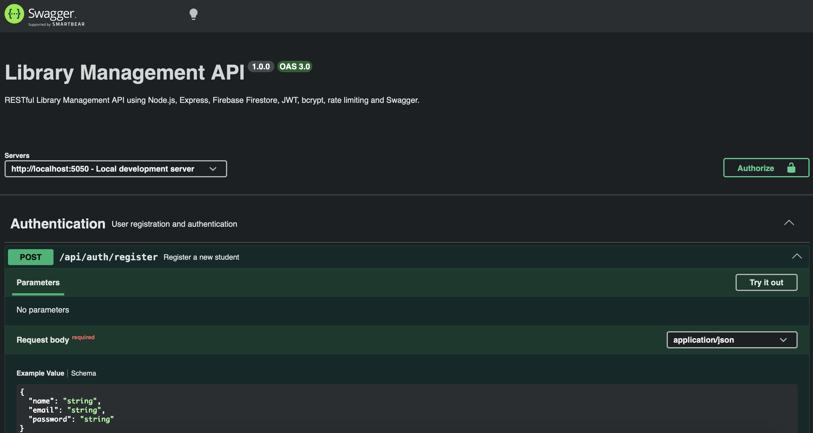

# Library Management API

A RESTful Library Management API built using Node.js, Express.js and Firebase Firestore.

## Tech Stack

- Node.js
- Express.js
- Firebase Admin SDK
- Firebase Firestore
- JWT
- bcryptjs
- express-rate-limit
- Swagger / OpenAPI 3.0
- dotenv
- CORS

## Features

- Student registration
- Librarian registration with secret key
- JWT-based authentication
- Password hashing using bcrypt
- Role-Based Access Control
- Book CRUD operations
- Book search and category filtering
- Borrow and return functionality
- Borrowing history
- Librarian borrow records
- Overdue report
- Firestore transactions
- API rate limiting
- Swagger API documentation

## Swagger_UI Screenshot



## Project Structure

```text
config/
├── firebaseConfig.js
└── swagger.js

controllers/
├── authController.js
├── bookController.js
└── borrowController.js

middleware/
├── auth.js
├── checkRole.js
└── rateLimiter.js

routes/
├── authRoutes.js
├── bookRoutes.js
└── borrowRoutes.js

server.js